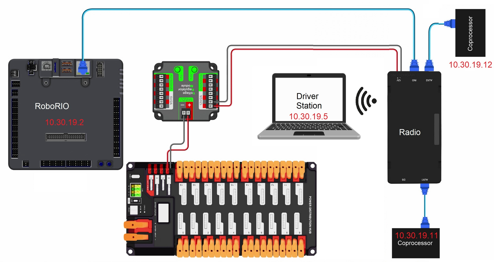

# Networking

## Overview

The robot has an onboard network mediated by the [robot radio](radio.md), which includes the [RoboRIO](roborio.md) and the [coprocessors](coprocessors.md).  The [driver station](driverstation.md) connects to these devices over the wifi access point provided by the radio, called "FRC 3019".  For [vision](vision.md) to work properly, the network should be configured with static IP's as shown in the above network diagram.

## Configuration

## Common Problems
